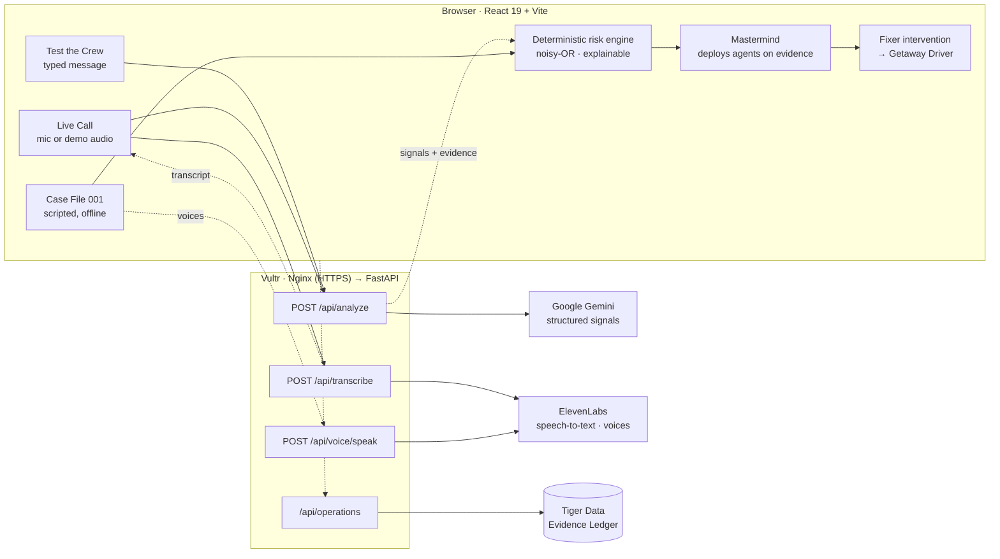
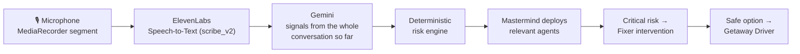

<div align="center">

# THE CREW

### Stop the heist before the vault opens.

**An AI counter-heist team that spots social engineering *while it's happening* and steps in before a manipulated person sends money.**

### 🔗 Live demo: **[thecrew.work](https://thecrew.work)**

[](https://thecrew.work)


</div>

---

Most fraud systems ask: **is this really the account holder?**
In a social-engineering scam the answer is *yes*. The real owner logs in, passes every check and sends the money themselves.

THE CREW asks a different question: **should this account holder be making this payment right now, or is someone manipulating them?**

| Try it in 60 seconds at [thecrew.work](https://thecrew.work) | |
|---|---|
| **01 · Run Case File 001** | A scripted, voiced "grandparent bail" scam from first call to money protected. Runs entirely in the browser. |
| **02 · Test the Crew** | Paste any suspicious text, email or call transcript. Gemini finds the tactics, and the score comes from our deterministic engine. |
| **03 · Live Call** | Speak (or play the demo audio). ElevenLabs transcribes it, Gemini analyzes it, and the crew responds as the call unfolds. |

---

## The problem

Scammers rarely need to hack anything. They call an elderly grandparent pretending to be a grandson under arrest, or impersonate the bank's fraud team, and **talk the legitimate account holder into sending the money**.

Every traditional control passes: right device, right password, right person. The weak point is human trust under pressure: urgency, fear, authority and *"don't tell anyone."*

## The solution

THE CREW watches the **context around a payment** as well as the payment itself, and combines four kinds of evidence:

| Evidence | Example | Where it comes from |
|---|---|---|
| **Conversation tactics** | urgency, emotional leverage, authority, secrecy, family emergency | Gemini (live modes) or pattern rules (Case File) |
| **Payment behaviour** | new recipient, amount far above the user's usual payments | the user's own payment history |
| **Trusted context** | caller's number ≠ the saved number for the person they claim to be | known contacts & payees |
| **Deterministic risk logic** | explainable, capped score; per-signal contributions | `src/engine/` |

**AI interprets. THE CREW decides.** Gemini only *extracts* signals. Our own code computes every score and makes every intervention decision. When money is about to move and the evidence is critical, THE CREW adds **smart friction**: it holds the payment, explains in plain words what it noticed, and routes the person to someone they **already trust**, on a number from their own contacts.

> **When does it intervene?** Not on a hunch. In Case File 001, only when a payment is submitted **and** risk is ≥ 80 (critical) **and** at least two different crew members have independent evidence ([`interventionPolicy.ts`](src/engine/interventionPolicy.ts)).

---

## Meet the crew

Seven specialists. The **Mastermind** deploys the others **only when the evidence calls for them**, so a harmless message never wakes up the whole team.

| | Agent | Role | Deployed when |
|---|---|---|---|
| 00 | **The Mastermind** | Orchestrator | Always on. Decides who else is needed, and classifies the threat. |
| 01 | **The Grifter** | Manipulation analyst | The conversation shows persuasion tactics (urgency, fear, authority, secrecy …). |
| 02 | **The Lookout** | Behaviour & payment watch | Money (or account access) enters the conversation. Compares it to the user's own history. |
| 03 | **The Inside Man** | Trusted context | Someone claims to be, or speak for, a person or institution. Checks claims against saved numbers and payees. |
| 04 | **The Safecracker** | Risk assessment | Several signals need weighing. Fuses evidence into one explainable score. |
| 05 | **The Fixer** | Intervention | Risk is critical. Builds an empathetic warning with safe options, never "Are you sure?". |
| 06 | **The Getaway Driver** | Safe exit | The person picks a safe option. Provides a concrete exit plan (hang up, block, report, reconnect). |

---

## How it works



- **All keys live on the server.** The browser only calls same-origin `/api/*`. The Gemini, ElevenLabs and Tiger Data credentials never reach the frontend.
- **One engine, three modes.** Each signal type has a fixed weight, scaled by Gemini's confidence. Signals under 0.35 confidence are ignored, evidence that can't be found in the text counts less, and only the strongest signal per tactic counts. They combine as independent evidence, `risk = 1 − Π(1 − wᵢ)`, so corroboration raises the score but it never claims 100%. Levels: **30** elevated · **55** high · **80** critical.
- **Explainable by construction.** Every signal shows its exact evidence phrase and how many points it added. Identical Gemini output always produces an identical score.

---

## Live Call

**Mission Control → LIVE CALL.** Press **Start listening**, let the caller speak (phone on speaker), then **Stop & analyze**.



- **A session, not one-off checks.** Each new segment is re-analyzed together with the conversation so far. Evidence is merged across segments (same tactic + same phrase = one entry), so repetition can't inflate the score.
- **Selective crew:** Grifter for manipulation language · Lookout for payment or account-access requests · Inside Man when the caller claims an identity · Safecracker once 2+ tactics corroborate · Fixer at critical risk · Getaway Driver once the person chooses a safe option (end the call, verify independently, call a trusted contact).
- **LOAD DEMO AUDIO:** three pre-recorded caller segments (ElevenLabs voice) go through the **same** transcription → Gemini → engine pipeline. Nothing about the transcript is hard-coded. Useful when there's no microphone, or on plain HTTP where browsers block the mic.
- **Honest failures:** a blocked mic shows a clear message with retry and demo audio. A failed transcription never produces a fake transcript. If Gemini fails, the transcript is kept and you can retry the analysis.

## Case File 001: the demo experience

A fictional, fully scripted **"grandparent / bail" scam** against Eleanor Parker. It runs entirely in the browser, and if voice is unavailable it simply plays as text.

1. **The call.** "Your grandson Daniel has been arrested… he needs $2,500 for bail… send it immediately… don't tell his parents." Risk climbs **14 → 39 → 58 → 76%** as the Grifter flags each tactic.
2. **The payment.** Eleanor opens her banking app. The **Lookout** sees a new recipient and an unusual amount. The **Inside Man** sees the caller's number doesn't match Daniel's saved number. The **Safecracker** fuses it all: **94% CRITICAL**.
3. **The intervention.** *"THE HEIST IS IN PROGRESS"*, with plain-language evidence, no blame, and large buttons. The recommended option is **Call Sarah (daughter)** on her *saved* number. *Verify Daniel*, *Wait 10 minutes* and *End the call safely* all work too.
4. **The getaway.** Sarah confirms Daniel is safe. The payment is stopped, a safe-exit checklist appears, then **$2,500 PROTECTED** and a **Mission Report** with a full timeline.

Voices (ElevenLabs, all premade, no cloned or real-person voices): the scam caller, a calm guardian for the warning, and Sarah/Daniel for verification. Controls: **Next event** (→ / N), **Auto play**, **Voice on/off**, **Reset**.

---

## Evidence Ledger: Tiger Data

Every operation (Case File 001, Test the Crew and Live Call) is recorded as a chronological, explainable evidence trail in **Tiger Data (PostgreSQL + TimescaleDB)**. The Mission Report and the end of a Live Call rebuild the ledger **from the database**: what was noticed and the exact phrase behind it, when risk escalated, which agents responded, why THE CREW intervened, what the person chose, and the outcome.

| Table | Kind | Holds |
|---|---|---|
| `operations` | table | mode, start/end, peak risk, final status, amount protected, threat type, outcome |
| `signals` | table, `UNIQUE(operation, type, evidence)` | de-duplicated evidence: label, confidence, short phrase, explanation, detecting agent, `times_seen` |
| `interventions` | table | trigger score, reasons, action selected, outcome |
| `risk_events` | **hypertable** | risk score & level over time |
| `agent_events` | **hypertable** | crew deployments and stand-downs |
| `milestones` | **hypertable** | payment initiated, segment analyzed (metadata only), verification, outcome |

- **TimescaleDB where it fits:** append-only streams are hypertables (7-day chunks). A **columnstore policy** segmented by `operation_id` compresses history after 7 days, and **`time_bucket`** powers the escalation trajectory ("first warning sign → critical in N s").
- **No duplicate evidence:** Gemini re-reads the whole call each segment. A repeat of the same tactic with the same, contained or ≥ 60%-overlapping phrase updates the existing row instead of adding one. Appends lock the operation row, and retries are idempotent.
- **Never on the safety path:** events are mirrored in small background batches with 4-second timeouts and a 30-second circuit breaker. If Tiger Data is unreachable, a subtle *Ledger offline* label appears, and every protection keeps working from the in-memory session copy.

**What is *not* stored:** no audio (no binary columns exist), no full transcripts or typed messages (only the short evidence phrase behind each signal, max 300 characters), no API keys or connection strings, and no IP addresses or device data.

---

## Sponsor technology

| Sponsor | How THE CREW uses it | Where |
|---|---|---|
| **Google Gemini** | Plays **the Grifter** in live modes: structured JSON output (`temperature 0`, response schema) returning signal type, confidence, the **exact evidence phrase**, claimed identity and requested action. It is instructed never to recommend blocking or allowing payments. `gemini-3.5-flash-lite`, with one retry on `gemini-3.1-flash-lite` if overloaded. | [`backend/services/gemini_service.py`](backend/services/gemini_service.py) |
| **ElevenLabs** | **Ears:** Speech-to-Text (`scribe_v2`, fallback `scribe_v1`) for Live Call. **Voice:** text-to-speech (`eleven_v4`, fallback `eleven_multilingual_v2`) for the Case File caller, guardian and family, and for the Live Call demo audio. Clips are cached on disk, so a cached demo keeps working even if the API is down. | [`backend/services/elevenlabs_service.py`](backend/services/elevenlabs_service.py), [`src/voice/`](src/voice/) |
| **Tiger Data** | The **Evidence Ledger**: hypertables, columnstore compression and `time_bucket` analytics over each operation's risk, agent and milestone streams. | [`backend/db/`](backend/db/), [`src/ledger/`](src/ledger/) |
| **Vultr** | Production host: an Ubuntu 24.04 instance running Nginx (static frontend + HTTPS + `/api` reverse proxy) and FastAPI under systemd, bound to localhost. | [`deploy/`](deploy/), [DEPLOYMENT.md](DEPLOYMENT.md) |
| **thecrew.work** | The production domain, served over HTTPS. | [thecrew.work](https://thecrew.work) |

> In one line: **Gemini understands the conversation. ElevenLabs gives THE CREW ears and a voice. Tiger Data gives it memory. Our deterministic policy decides when to intervene.**

---

## Privacy & safety

- **Deterministic safety decisions.** Gemini proposes signals. Fixed weights, thresholds and the intervention policy, written in our own code, decide. If the AI is unavailable, **no fallback ever fabricates an AI result**.
- **Grounded evidence.** Every Gemini evidence phrase is located in the submitted text (exact, then case/quote-insensitive, then whitespace-tolerant). Evidence that can't be found is flagged and weighted down.
- **Audio stays in memory.** The microphone starts only on click and is released on Stop. The backend checks each upload's declared type **and** file signature (1 KB–10 MB), sends it to ElevenLabs, then discards it. It is never written to disk.
- **Nothing sensitive is logged.** Submitted text and transcripts aren't logged or stored. API keys are sent only as request headers and never logged, and the database layer logs only exception types, never hosts or credentials.
- **Abuse limits.** In-memory per-IP rate limits: 12 analyses, 20 transcriptions and 30 new voice generations per minute. Inputs are capped at 2,000 characters, and unknown fields are rejected.
- **Humane intervention.** Plain language, no blame, one decision at a time, large type and buttons. Status is never shown by colour alone, the intervention is a focus-managed `alertdialog`, `prefers-reduced-motion` is respected, and *Read this to me* speaks the warning aloud.
- **Fictional demo data.** Eleanor, Daniel, Sarah and every number in Case File 001 are made up.

---

## Technology

| Layer | Stack |
|---|---|
| **Frontend** | React 19, TypeScript, Vite 8, Tailwind CSS 4, Framer Motion, Lucide icons |
| **Backend** | Python · FastAPI · Uvicorn · Pydantic v2 · httpx · asyncpg |
| **AI** | Google Gemini (REST `generateContent`, structured output) |
| **Voice** | ElevenLabs Text-to-Speech + Speech-to-Text |
| **Database** | Tiger Data (PostgreSQL + TimescaleDB) |
| **Production** | Vultr (Ubuntu 24.04) · Nginx · systemd · HTTPS at [thecrew.work](https://thecrew.work) |
| **Tests** | `pytest` (mocked Gemini/ElevenLabs, optional real-DB ledger tests) · deterministic TS checks via `tsx` |

---

## Running locally

**Requires:** Node.js `^20.19` or `>=22.12` · Python 3.

```bash
# 1. Frontend
npm install
npm run dev                       # → http://localhost:5173  (Case File 001 works with just this)

# 2. Backend (needed for Test the Crew, Live Call, voice, ledger)
cd backend
python3 -m venv .venv
.venv/bin/pip install -r requirements.txt     # Windows: .venv\Scripts\pip
cp .env.example .env                          # then fill in your own keys
.venv/bin/uvicorn main:app --reload --port 8000
```

In development Vite proxies `/api` to `http://127.0.0.1:8000`, so the frontend needs no configuration and no keys.

`backend/.env` (git-ignored, **never commit it**):

| Variable | Needed for | Required? |
|---|---|---|
| `GEMINI_API_KEY` | Test the Crew, Live Call analysis ([get a key](https://aistudio.google.com/apikey)) | for live modes |
| `ELEVENLABS_API_KEY` | Voices, Live Call transcription & demo audio (key needs TTS **and** STT access) | for voice / Live Call |
| `DATABASE_URL` | Tiger Data Evidence Ledger. Without it, an in-memory session ledger is used. | optional |

Without the backend or a key, the live modes show a clear "offline" message with Retry, and Case File 001 is unaffected.

| Command | What it does |
|---|---|
| `npm run build` | Typecheck + production build to `dist/` |
| `npm run typecheck` | TypeScript only |
| `npm run test:risk` | Risk-engine checks: determinism, order-independence, 100% cap, Case File progression (no network) |
| `npm run test:live` | Live Call session logic: windowing, de-duplication, selective deployment (no network) |
| `npm run smoke:live` | Sends 3 reference messages to the running backend (needs Gemini key) |
| `npm run prewarm:voice` | Generates and caches all demo voice clips (needs backend + ElevenLabs key) |
| `npm run db:migrate` | Applies Evidence Ledger migrations to `DATABASE_URL` (the backend also migrates at startup) |
| `cd backend && .venv/bin/pip install -r requirements-dev.txt && .venv/bin/python -m pytest` | Backend tests (mocked Gemini and ElevenLabs, no keys needed) |

## Production deployment

Production runs at **[https://thecrew.work](https://thecrew.work)** on a **Vultr** Ubuntu 24.04 instance:

```
Internet ─HTTPS─► Nginx ─┬─ /      → React production build (dist/)
                         └─ /api/  → FastAPI on 127.0.0.1:8000 (systemd, never public)
```

Frontend and API share one origin, so no CORS configuration or frontend environment variables are needed. Secrets live only in the server's `backend/.env`. The Nginx site and systemd unit are in [`deploy/`](deploy/), and the full step-by-step runbook is in **[DEPLOYMENT.md](DEPLOYMENT.md)**.

---

## Repository structure

```
the-crew/
├── src/
│   ├── agents/          one module per crew member (Mastermind, Grifter, Lookout, …)
│   ├── engine/          riskEngine · liveRiskEngine · interventionPolicy
│   ├── data/            crew roster, signal catalog, Case File 001 scenario
│   ├── screens/         Mission Control (landing) + Case File operation
│   ├── operation/       command-centre panels + pure mission state
│   ├── intervention/    intervention, verification, cool-down, getaway, protected
│   ├── live-analysis/   Test the Crew (Gemini)
│   ├── live-call/       Live Call session, mic capture, transcription
│   ├── voice/           ElevenLabs playback + Case File voice
│   ├── ledger/          Evidence Ledger client + UI
│   └── mission-report/  report builder + timeline
├── backend/
│   ├── main.py          FastAPI app: analyze, transcribe, voice, health
│   ├── services/        gemini_service · elevenlabs_service
│   ├── db/              Tiger Data pool, migrations, ledger repository
│   ├── routes/          Evidence Ledger API
│   └── tests/           pytest suite
├── scripts/             risk / live checks, smoke test, voice prewarm
├── deploy/              Nginx site + systemd unit (no secrets)
└── DEPLOYMENT.md        Vultr production runbook
```

---

## Team

Built for **RowdyHacks XII**: *SWIVEL: The Social Engineering Shield*.

<!-- Add team member names and roles here. -->
**Ruchika Sharma**
**Pranav Wani**
<div align="center">

**THE CREW: because the best time to stop a heist is before the vault opens.**

</div>
